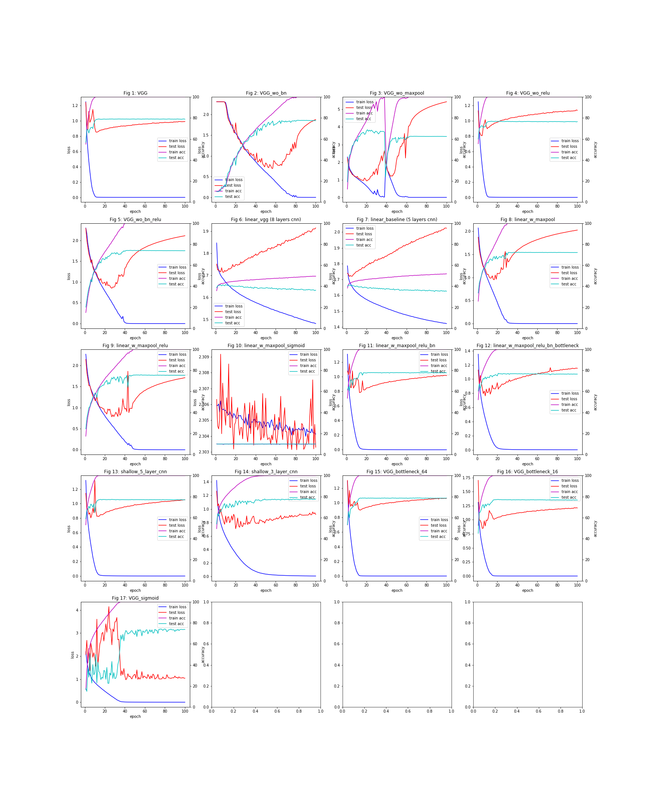

# CNN-ablation-study-cifar10
The little project studies the performance of different CNN architecture on cifar10 dataset.

### To-do list:
- [x] add experiment result
- [ ] add explanations for model name 
- [ ] add insights from the figure above
- [ ] experiments on dropout

